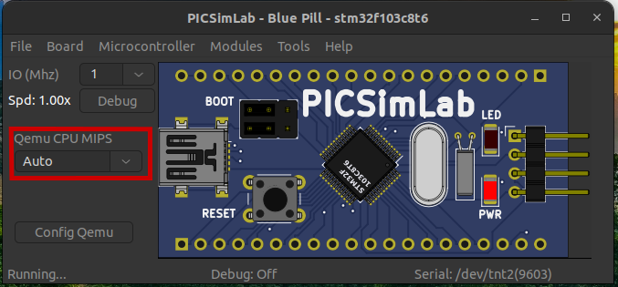

# Bare-metal Rust Development with PICSimLab

## Board details


https://stm32-base.org/boards/STM32F103C8T6-Blue-Pill.html

- **Microcontroller**:         STM32F103C8
- **Flash**:   64 KB
- **RAM**:     20 KB
- **Clock Speed**:     72 MHz
- **User LED(s)**:     PC13 (blue; lights when PC13 is LOW)

## STM32F103C8

https://www.st.com/en/microcontrollers-microprocessors/stm32f103c8.html

The STM32F103xx medium-density performance line family incorporates the high-performance ARM®Cortex®-M3 32-bit RISC core operating at a 72 MHz frequency, high-speed embedded memories, and an extensive range of enhanced I/Os and peripherals connected to two APB buses. All devices offer two 12-bit ADCs, three general purpose 16-bit timers plus one PWM timer, as well as standard and advanced communication interfaces: up to two I2Cs and SPIs, three USARTs, an USB and a CAN. 

# Install dependencies

## Rust Installation

https://rustup.rs/
```
curl https://sh.rustup.rs -sSf | sh
```

### Enable Cortex-M3 Development

```
rustup target add thumbv7m-none-eabi
```

Note: What is Thumb? See [here](https://en.wikipedia.org/wiki/ARM_architecture#Thumb)?

### Install the Supporting Tools

```
cargo install cargo-binutils
rustup component add llvm-tools-preview
```

```
sudo apt install \
  gdb-multiarch \
  binutils-arm-none-eabi
```

# Download the project

```console
git clone https://github.com/Doulos/Embedded-Rust-with-PicSimLab.git
```

# Moving to the Project's directory

```console
cd Embedded-Rust-with-PicSimLab
```

# Build

Build the provided project (inside the project's root directory):
```
cargo build --release                                                             
arm-none-eabi-objcopy -O binary target/thumbv7m-none-eabi/release/bluepill app.bin
```

You can achieve the same thing by running the shell script: 

```
./run_me.sh
```

# Installing GDB's gdb-dashboard 

- Optionally you can install `gdb-dashboard` for an improved debugging experience by placing the `.gdbinit` file in your home directory.

``` 
wget -P ~ https://github.com/cyrus-and/gdb-dashboard/raw/master/.gdbinit
```

**Note**:Depending on your OS setup, GDB might not be able to pick up the `.gdbinit` directly from your home directory. In this case, you can try to copy the `.gdbinit` file to the project's directory instead. If this still doesn't not get picked up automatically, You will have to provide it explicitly as you are calling GDB's command line (see later for an example).

- Optionally, If you want a little bit more eye candy with syntax highlighting inside GDB, you can install:

````
pip install pygments
````

# Getting PicSimLab

PicSimLab is an open-source virtual development boards environment allowing you to execute programs on various popular dev-boards without the need of a Physical board. 

- Install PicSimLab (currently using the unstable version : 0.9.2_240706).

https://github.com/lcgamboa/picsimlab/releases/tag/latestbuild

Various executable options are provided in the release web-page, you will need to download and execute the relevant one.


When invoked for the first time, the default board displayed is an Arduino Uno board. For this exercise however, we will use the Cortex-M3 based Blue Pill board.

- Inside the PICSimLab window choose the `Blue Pill` board by selecting the `Board->Blue Pill` sub menu
- Set the `Qemu CPU MIPS` option to Auto. 



- Click on the `Config Qemu` button and select the `Wait for GDB` option:

 

- Configure PICSimLab by selecting the sub-menu: `File->Configure` and capture the following values:


- Enable debug by clicking on the `Debug button` and make sure that the GDB debug port shows: 1234

 

- Inside the PICSimLab window, display the peripherals used in this demo by selecting the sub-menu `Modules->Spare Parts` 

- In the `Spare Parts` window, load the provided `periph_configuration.pcf` file by selecting the sub-menu `File ->Load configuration`


- Inside the PicSimLab window, load the binary file `app.bin` created in an early step with the sub-menu: `File->Load Bin`


- Inside a terminal window, navigate to the project's directory and call the GDB debugger with the command:

```
gdb-multiarch target/thumbv7m-none-eabi/release/bluepill
```

Alternatively, If you are having difficulties getting the `.gdbinit` file to get detected by GDB, you can use the command:

```
gdb-multiarch target/thumbv7m-none-eabi/release/bluepill -x .gdbinit
```


- Connect GDB to the QEMU (blue pill) GDB server with the command:

  `target extended-remote localhost:1234`

  And you are rolling! You can issue the following commands to get you started with the GDB debug session:

```
break main
continue
step
next
run
```

To exit a running application you can type: `Ctrl+c` .

To reset the embedded program's execution, you can type `system_reset`

A helpful GDB tutorial can be found here: 

https://freecoder.dev/gdb-cheat-sheet/

A helpful cheat-sheet can be found here:

https://freecoder.dev/GDB_Cheat_Sheet.pdf


# Links

- [Rust embedded book](https://rust-embedded.github.io/book/intro/index.html)
- [Blue pill](https://stm32-base.org/boards/STM32F103C8T6-Blue-Pill.html)
- [PicSimLab](https://lcgamboa.github.io/picsimlab_docs/stable/)
- [STM32F103C8 info and datasheets](https://www.st.com/en/microcontrollers-microprocessors/stm32f103c8.html)
- [stm32f1xx-hal crate](https://github.com/stm32-rs/stm32f1xx-hal)
- [awesome-embedded-rust](https://github.com/rust-embedded/awesome-embedded-rust)

# Troubleshooting

- PICSimLab has crashed and now, it keeps-on exiting immediately whenever I call it.

PICSimLab is configured to load automatically the last configuration used, each time you invoke it. To go back to a clean initial setup, simply remove the directory `.picsimlab` located inside your home directory. 
